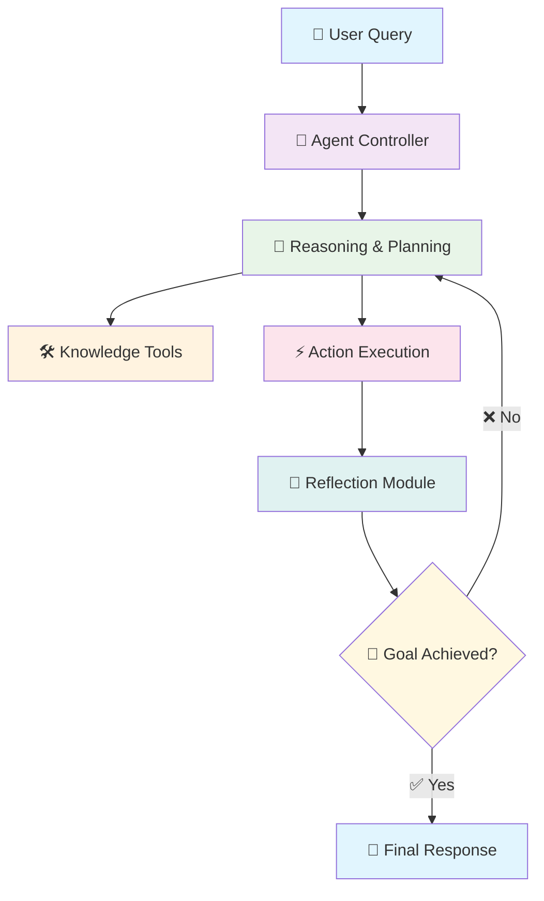

<div align="center">

# 🤖 Intelligent AI Agents: Advanced Reasoning & Reflection Systems 🧠


<picture>
  <source media="(prefers-color-scheme: dark)" srcset="https://github.com/abuzar01440/AI-agents-/assets/raw/main/images/ai_agents_banner_dark.png">
  <source media="(prefers-color-scheme: light)" srcset="https://github.com/abuzar01440/AI-agents-/assets/raw/main/images/ai_agents_banner_light.png">
  
</picture>

</div>

<p align="center">
  <i>🚀 Building intelligent agents that can reason, reflect, and adapt using state-of-the-art open-source models 🤖</i>
</p>

---

## 🌟 What Are AI Agents?

AI Agents are autonomous systems that can **perceive** their environment, **reason** about problems, **take actions**, and **learn** from experience. Unlike traditional chatbots that simply respond to queries, AI agents can:

- 🧠 **Think step-by-step** through complex problems
- 🔄 **Reflect** on their own performance and mistakes
- 🛠️ **Use tools** to gather information and perform actions
- 📈 **Improve** over time through experiential learning
- 🎯 **Adapt** their strategies based on feedback

Think of them as **digital assistants** that don't just answer questions, but actively solve problems by reasoning, planning, and executing multi-step workflows! 👤➡️🤖

---

## 📋 Table of Contents
- [🚀 Project Overview](#-project-overview)
- [✨ Key Technologies](#-key-technologies)
- [🧩 Agent Architecture](#-agent-architecture)
- [📊 Agent Types](#-agent-types)
- [💰 Cost Analysis](#-cost-analysis)
- [💻 Running on Kaggle](#-running-on-kaggle)
- [⚙️ Setup & Installation](#️-setup--installation)
- [📘 Usage Examples](#-usage-examples)
- [🤝 Contributing](#-contributing)

---

## 🚀 Project Overview

This repository demonstrates a collection of **Intelligent AI Agents** built using cutting-edge technologies:

- 🦜 **LangChain** framework for LLM orchestration and agent workflows
- 📊 **LangGraph** for complex, stateful multi-agent systems
- 💎 **Google Gemma 2B-IT** for efficient reasoning and reflection tasks
- ✨ **Google Gemini 1.5 Flash** for advanced human-in-the-loop interactions
- 🧠 **Advanced prompting techniques** for enhanced reasoning capabilities

Our agents showcase different paradigms of AI reasoning - from simple tool usage to sophisticated self-reflection and continuous learning. Each agent demonstrates unique capabilities while maintaining practical applicability for real-world scenarios. 🌍

<div align="center">
  <picture>
    <source media="(prefers-color-scheme: dark)" srcset="https://raw.githubusercontent.com/langchain-ai/langchain/master/docs/static/img/agent_flowchart_dark.png">
    <source media="(prefers-color-scheme: light)" srcset="https://raw.githubusercontent.com/langchain-ai/langchain/master/docs/static/img/agent_flowchart.png">
    
  </picture>
</div>

---

## ✨ Key Technologies

<table align="center">
  <tr>
    <td align="center"></td>
    <td><b>🐍 Python 3.x</b><br>The foundation of our implementation, providing the flexibility and ecosystem needed for AI development.</td>
  </tr>
  <tr>
    <td align="center">🦜</td>
    <td><b>LangChain</b><br>The versatile framework for developing applications powered by large language models. It provides the building blocks for creating chains and agents.</td>
  </tr>
  <tr>
    <td align="center">📊</td>
    <td><b>LangGraph</b><br>An extension of LangChain specifically designed for building robust, stateful, and multi-actor applications with LLMs. It enables defining workflows as directed graphs with loops, conditional logic, and advanced agentic behavior.</td>
  </tr>
  <tr>
    <td align="center">💎</td>
    <td><b>Google Gemma 2B-IT</b><br>A powerful yet efficient Small Language Model (SLM) from Google, optimized for instruction-following tasks. Used in our Reflexion agent for cost-effective reasoning and reflection.</td>
  </tr>
  <tr>
    <td align="center">✨</td>
    <td><b>Google Gemini 1.5 Flash</b><br>Google's fast and versatile large language model with multimodal capabilities. Employed in our Human-in-the-Loop agent for sophisticated conversation and content generation.</td>
  </tr>
  <tr>
    <td align="center">🦙</td>
    <td><b>Llama 3.2 (Legacy)</b><br>Meta's open-source large language model, included for compatibility and comparison purposes in some implementations.</td>
  </tr>
  <tr>
    <td align="center"></td>
    <td><b>Kaggle</b><br>The cloud-based platform providing the computational environment (including GPUs) necessary to run advanced AI models without expensive local hardware. 🚀</td>
  </tr>
</table>

---

## 🧩 Agent Architecture

Our agents follow a sophisticated architecture that combines the best practices in LLM-based agent design: 🏗️



### 🔄 How It Works

1. **👤 User Input**: The journey begins with your query or task
2. **🤖 Agent Controller**: Orchestrates the entire workflow
3. **🧠 Reasoning & Planning**: Breaks down complex problems into manageable steps
4. **🛠️ Knowledge Tools**: Accesses external APIs, databases, and search engines
5. **⚡ Action Execution**: Performs the planned actions
6. **🔄 Reflection Module**: Evaluates performance and identifies improvements
7. **🎯 Decision Point**: Determines if the goal is achieved or more iterations are needed
8. **📝 Final Response**: Delivers the refined, high-quality result

This architecture ensures that our agents don't just respond—they **think**, **act**, **reflect**, and **improve**! 🚀

---

## 📊 Agent Types

<div align="center">
  <table>
    <tr>
      <th>🤖 Agent Type</th>
      <th>📝 Description</th>
      <th>🎯 Key Features</th>
      <th>⚙️ Model Used</th>
    </tr>
    <tr>
      <td align="center">
        <h3>🔄 ReAct Agent</h3>
        <i>using LangChain</i>
      </td>
      <td>Implements the <b>Reasoning + Acting</b> paradigm that allows the agent to think step-by-step while interacting with tools. 🧠➡️🛠️</td>
      <td>
        • 💭 Reasoning trace generation<br>
        • 🔧 Tool selection & usage<br>
        • ⚡ Sequential task solving
      </td>
      <td align="center">
        <b>🦙 Llama 3.2</b><br>
        <i>Instruct-tuned</i>
      </td>
    </tr>
    <tr>
      <td align="center">
        <h3>🤔 Reflection Agent</h3>
        <i>using LangGraph</i>
      </td>
      <td>Extends the ReAct paradigm with the ability to <b>reflect on its reasoning process</b> and self-correct mistakes. 🔍✨</td>
      <td>
        • 🔄 Self-evaluation loops<br>
        • 🚨 Error detection & correction<br>
        • 📈 Strategy refinement
      </td>
      <td align="center">
        <b>🦙 Llama 3.2</b><br>
        <i>Instruct-tuned</i>
      </td>
    </tr>
    <tr>
      <td align="center">
        <h3>🔁 Reflexion Agent</h3>
        <i>using LangGraph</i>
      </td>
      <td>Combines reflection with <b>experiential learning</b> to continuously improve performance based on past attempts. 📚🎯</td>
      <td>
        • 💾 Memory of past attempts<br>
        • 📊 Performance tracking<br>
        • 🎭 Adaptive strategies
      </td>
      <td align="center">
        <b>💎 Gemma 2B-IT</b><br>
        <i>Efficient SLM</i>
      </td>
    </tr>
    <tr>
      <td align="center">
        <h3>👤 Human-in-the-Loop Agent</h3>
        <i>using LangGraph</i>
      </td>
      <td>Integrates <b>human feedback</b> directly into the agent's decision-making process for enhanced accuracy and personalization. 🤝🤖</td>
      <td>
        • 🗣️ Interactive feedback loops<br>
        • 🎯 Personalized responses<br>
        • ✅ Human validation steps
      </td>
      <td align="center">
        <b>✨ Gemini 1.5 Flash</b><br>
        <i>Multimodal LLM</i>
      </td>
    </tr>
  </table>
</div>

---

## 💰 Cost Analysis

Understanding the computational costs and efficiency of different AI agents is crucial for practical deployment. Here's a comprehensive breakdown:

<div align="center">
  <table>
    <tr>
      <th>🤖 Agent Type</th>
      <th>💎 Model Used</th>
      <th>💰 Cost Tier</th>
      <th>⚡ Performance</th>
      <th>🎯 Best Use Case</th>
    </tr>
    <tr>
      <td align="center"><b>🔁 Reflexion Agent</b></td>
      <td>💎 Gemma 2B-IT</td>
      <td>🟢 <b>Very Low</b><br>~$0.001/1K tokens</td>
      <td>⚡ Fast & Efficient</td>
      <td>🔄 Iterative problem-solving, learning tasks</td>
    </tr>
    <tr>
      <td align="center"><b>👤 Human-in-Loop</b></td>
      <td>✨ Gemini 1.5 Flash</td>
      <td>🟡 <b>Moderate</b><br>~$0.02/1K tokens</td>
      <td>🚀 High Quality</td>
      <td>✍️ Content generation, complex reasoning</td>
    </tr>
    <tr>
      <td align="center"><b>🔄 ReAct Agent</b></td>
      <td>🦙 Llama 3.2</td>
      <td>🟢 <b>Low</b><br>~$0.005/1K tokens</td>
      <td>🎯 Balanced</td>
      <td>🛠️ Tool usage, multi-step workflows</td>
    </tr>
    <tr>
      <td align="center"><b>🤔 Reflection Agent</b></td>
      <td>🦙 Llama 3.2</td>
      <td>🟡 <b>Moderate</b><br>~$0.01/1K tokens</td>
      <td>🧠 Thoughtful</td>
      <td>📊 Quality-critical applications</td>
    </tr>
  </table>
</div>

### 💡 Cost Optimization Tips

- **🎯 For Learning & Experimentation**: Start with **Gemma 2B-IT** - it's incredibly cost-effective!
- **⚡ For Production Applications**: **Gemini 1.5 Flash** offers the best balance of speed and quality
- **🔄 For Iterative Tasks**: **Reflexion Agent** with Gemma provides excellent cost-per-improvement ratio
- **🤖 For Complex Reasoning**: Human-in-the-Loop with Gemini ensures high-quality outputs

---

## 💻 Running on Kaggle

<div align="center">
  <picture>
    <source srcset="https://www.kaggle.com/static/images/kaggle-logo-transparent-300.png">
    
  </picture>
</div>

This project is specifically designed to run on **Kaggle**, leveraging their amazing free resources: 🎉

- 🆓 **Free GPU Access**: Run advanced AI models without expensive hardware
- 🔄 **Persistent Notebooks**: Save and share your agent experiments
- 📚 **Datasets Integration**: Easily connect to various data sources
- 🧩 **Pre-installed Libraries**: Many dependencies come pre-configured
- 👥 **Community Support**: Learn from thousands of other AI practitioners

### 🚀 Quick Start on Kaggle

1. 📥 **Fork this repository** or download the notebooks
2. 📤 **Upload to a new Kaggle notebook**
3. 🖥️ **Select GPU accelerator** (T4 x2 recommended for best performance)
4. 🔐 **Add your API keys** (Tavily, Google AI, etc.)
5. ▶️ **Run the cells** to see the agents in action!

### 💡 Pro Tips for Kaggle

- 🔋 **GPU Hours**: Each user gets 30 hours/week of free GPU time
- 💾 **Save Often**: Use Kaggle's auto-save feature for your experiments
- 🌟 **Make Public**: Share your notebooks to inspire others!
- 📊 **Use Datasets**: Leverage Kaggle's vast dataset library for testing

---

## ⚙️ Setup & Installation

If you're running locally instead of on Kaggle, you'll need to set up the environment:

```bash
# Clone the repository
git clone https://github.com/abuzar01440/AI-agents-.git
cd AI-agents-

```

---

## 📘 Usage Examples

<details>
<summary><b>🔄 ReAct Agent Example</b></summary>

```python
from langchain.agents import ReActAgent
from langchain.llms import Llama
from langchain.tools import TavilySearchResults

# Initialize the Llama model
llm = Llama(model_path="path/to/llama-3.2-instruct")

# Setup search tool
search = TavilySearchResults(max_results=3)

# Create the agent
agent = ReActAgent.from_llm(
    llm=llm, 
    tools=[search],
    verbose=True
)

# Run the agent
response = agent.run("What is the capital of France and what's its population?")
print(response)
```
</details>

<details>
<summary><b>🤔 Reflection Agent Example</b></summary>

```python
from langgraph.graph import StateGraph
from langchain.llms import Llama

# Initialize the Llama model
llm = Llama(model_path="path/to/llama-3.2-instruct")

# Define the graph
graph = StateGraph()
graph.add_node("reasoning", reasoning_node)
graph.add_node("reflection", reflection_node)
graph.add_node("action", action_node)

# Add edges for reflection loop
graph.add_edge("reasoning", "action")
graph.add_edge("action", "reflection")
graph.add_edge("reflection", conditional_edge)

# Compile the graph
agent = graph.compile()

# Run the agent
response = agent.invoke({"query": "Solve this math problem: 23 × 7 + 5^2"})
print(response)
```
</details>

<details>
<summary><b>🔁 Reflexion Agent Example (Gemma 2B-IT)</b></summary>

```python
from transformers import pipeline
from langchain_huggingface import HuggingFacePipeline
from langgraph.graph import StateGraph

# Initialize Gemma 2B-IT model
pipe = pipeline(
    "text-generation", 
    model="google/gemma-2b-it",
    max_new_tokens=512,
    temperature=0.7,
    do_sample=True,
    repetition_penalty=1.1
)

# Create LangChain LLM
llm = HuggingFacePipeline(pipeline=pipe)

# Define reflexion workflow
def reflexion_workflow():
    workflow = StateGraph()
    workflow.add_node("generate", generate_node)
    workflow.add_node("reflect", reflect_node)
    workflow.add_node("revise", revise_node)
    
    # Add reflexion loop
    workflow.add_edge("generate", "reflect")
    workflow.add_edge("reflect", "revise")
    workflow.add_edge("revise", END)
    
    return workflow.compile()

# Execute reflexion
agent = reflexion_workflow()
result = agent.invoke({"question": "Write a comprehensive analysis of AI agents"})
print(result)
```
</details>

<details>
<summary><b>👤 Human-in-the-Loop Agent Example (Gemini 1.5 Flash)</b></summary>

```python
from langchain_google_genai import ChatGoogleGenerativeAI
from langgraph.graph import StateGraph
from langgraph.prebuilt import ToolExecutor

# Initialize Gemini 1.5 Flash
llm = ChatGoogleGenerativeAI(
    model="gemini-1.5-flash",
    temperature=0.7,
    max_tokens=1024
)

# Define human-in-the-loop workflow
def create_human_loop_agent():
    workflow = StateGraph()
    
    # Add nodes
    workflow.add_node("ai_draft", ai_draft_node)
    workflow.add_node("human_feedback", human_feedback_node)
    workflow.add_node("revise", revise_node)
    workflow.add_node("final_output", final_output_node)
    
    # Add edges with human intervention
    workflow.add_edge("ai_draft", "human_feedback")
    workflow.add_conditional_edges(
        "human_feedback",
        human_decision,
        {
            "approve": "final_output",
            "revise": "revise",
            "restart": "ai_draft"
        }
    )
    
    return workflow.compile()

# Usage
agent = create_human_loop_agent()
result = agent.invoke({
    "task": "Write a professional email to a professor",
    "context": "PhD application inquiry"
})
print(result)
```
</details>


---

## 🤝 Contributing

We welcome contributions to improve the agents or add new features! Here's how you can help: 🌟

### 🚀 How to Contribute

1. 🍴 **Fork the repository** (`git fork`)
2. 🌿 **Create a feature branch** (`git checkout -b feature/amazing-feature`)
3. 💻 **Implement your enhancement** with proper testing
4. 🧪 **Test thoroughly** with multiple AI models
5. 📝 **Document your changes** and update README if needed
6. 🚀 **Submit a pull request** with detailed description

### 💡 Contribution Ideas

- 🤖 **New Agent Types**: Implement novel reasoning paradigms
- 🔧 **Tool Integration**: Add new tools and APIs
- 📊 **Performance Optimization**: Improve efficiency and speed
- 🎯 **Use Case Examples**: Add domain-specific implementations
- 📚 **Documentation**: Enhance tutorials and guides
- 🐛 **Bug Fixes**: Help us squash those pesky bugs

### 🏆 Contributors Welcome

We're looking for contributors in various areas:
- 👩‍💻 **Developers**: AI integration, LangGraph enhancements
- 🎨 **UI/UX Designers**: Visual improvements and user experience
- 📚 **Technical Writers**: Documentation and tutorials
- 🧪 **QA Engineers**: Testing and model evaluation
- 🌍 **Translators**: International community support
- 🎓 **Domain Experts**: Specialized use cases and validation

### 📋 Development Guidelines

- 🔍 **Code Quality**: Follow PEP 8 standards
- 📝 **Documentation**: Comment your code thoroughly
- 🧪 **Testing**: Include tests for new features
- 🔒 **Security**: Never commit API keys or sensitive data
- 🎯 **Performance**: Optimize for efficiency when possible

---

<div align="center">
  <h2>🌟 Star This Repository! 🌟</h2>
  <p>
    <a href="https://github.com/abuzar01440">
      
    </a>
    <a href="https://github.com/abuzar01440/AI-agents-">
      
    </a>
  </p>
  
  <p>
    
    
  </p>

  <p>
    <b>Created with 💙 by <a href="https://github.com/abuzar01440">abuzar01440</a></b><br>
    📧 abuzarbhutta@gmail.com | 📧 abuzarbhutta.0@outlook.com<br>
    🗓️ Last Updated: January 2025
  </p>
  
  <p>
    <i>🚀 "Building smarter agents, one reflection at a time" 🤖</i>
  </p>

  <h3>🎯 Quick Links</h3>
  <p>
    <a href="#-what-are-ai-agents">🤖 What are AI Agents?</a> • 
    <a href="#-agent-types">📊 Agent Types</a> • 
    <a href="#-cost-analysis">💰 Cost Analysis</a> • 
    <a href="#-usage-examples">📘 Examples</a>
  </p>
</div>
